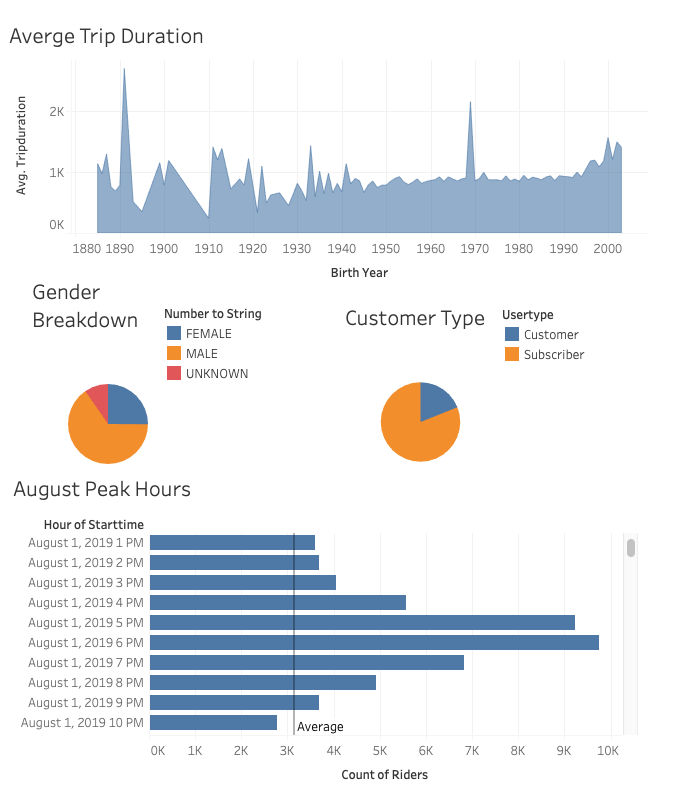
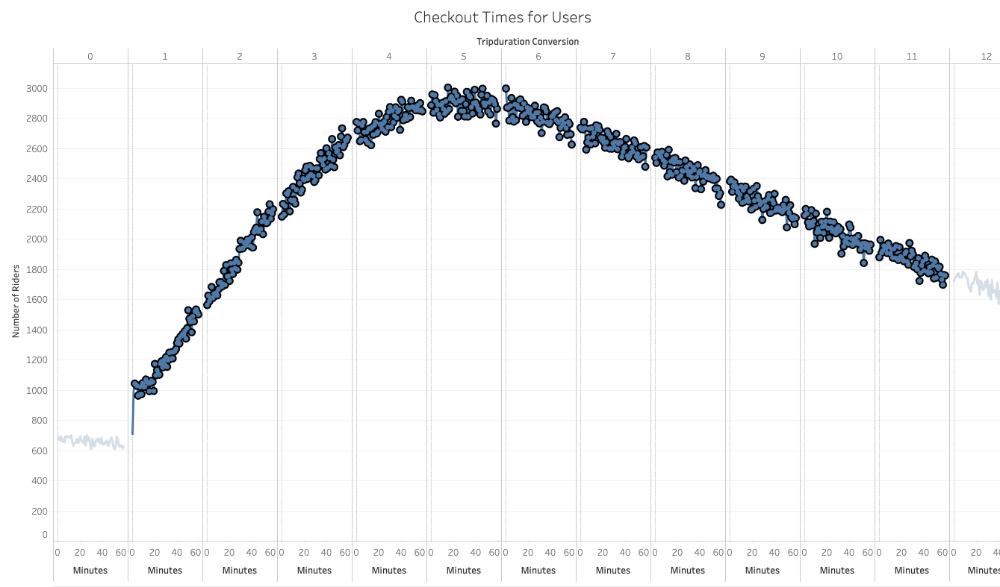
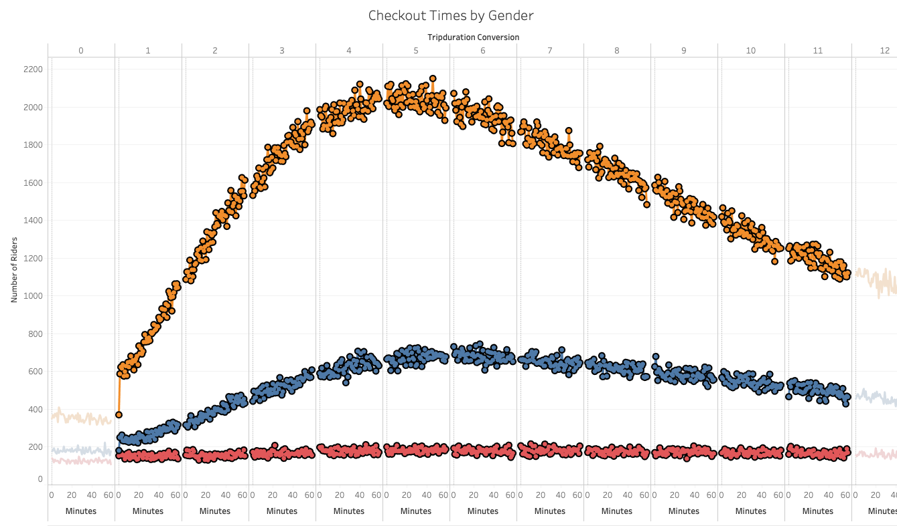
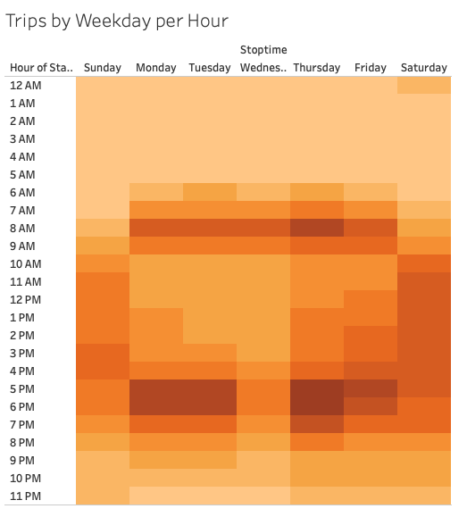
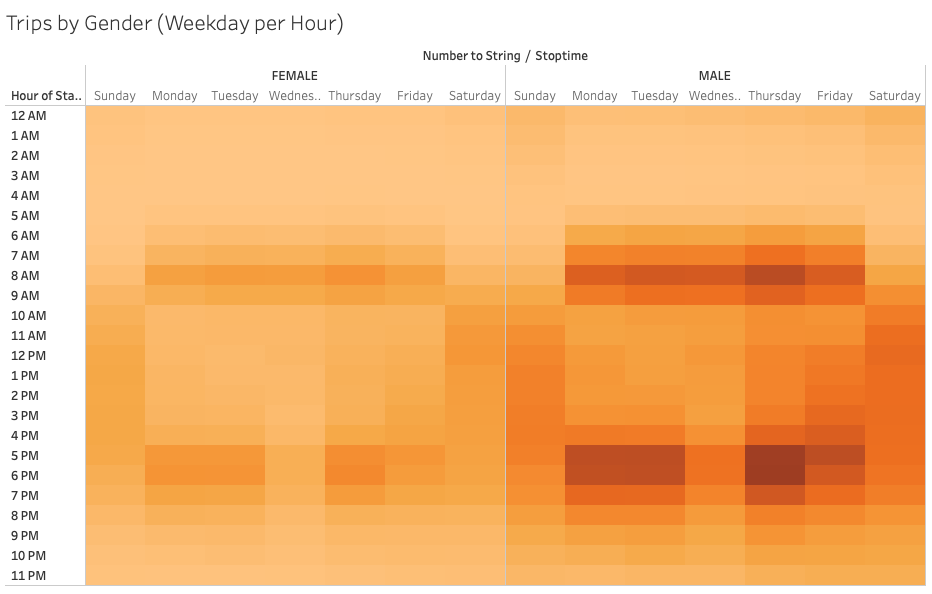
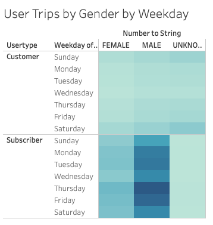

# bikesharing
 
## Abstract
Using Tableau and Python, I used New York City Citibike data to create a business plan and presentation with the hope that the plan can be deployed in Des Moines.

## Results
_Please see the below for my results visualized using Tableau Story with descriptions of relevant takeaways accompanying each image._

[link to dashboard](https://public.tableau.com/profile/isaac3544#!/vizhome/NYCCitibikeUsageforAugust2019/Story2)

 
Citibike's most consistent users are middle aged to younger users, ranging from 50 to early 20. MALEs use Citibike more often then FEMALEs. And, the client base tends heavily towards using the subscriptions, making repeat users a tentatively ripe possibility.

### Getting Granular

User use ranges drastically affording Citibike ample windows for both maintenance and promotions intended to increase use. High use periods are brief, but are very high use periods making them the most profitable and the riskiest time of the day. They can make or break a business day's cash flow.
 

 
Riders are most likely to opt for 4-6 hours of use and then use trends down consistently. Given the consistency in how riders use the bikes there may be different sentiments behind why the trips are as long as they are. Potentially something to explore here on the marketing front.
 

 
MALEs and FEMALEs use the bikes similarly in terms of length of use. The difference here is primarily in volume which we covered earlier.
 

MALEs and FEMALEs use the bikes similarly in terms of when they use Citibike. The color densisty difference here is caused by volume which skews MALE .
 

 

## Summary
_High-level summary of the results and additional findings (2 images)._

## Appendix

### Resources
- Data - https://www.citibikenyc.com/system-data -> https://s3.amazonaws.com/tripdata/index.html -> https://s3.amazonaws.com/tripdata/201908-citibike-tripdata.csv.zip
- Software - Python / Jupyter Notebook, Tableau Public

### Project Background and Initial Thoughts
This project begins under the pretext that a friend and I are huge fans of Citibike, a bike sharing business privately run throughout different cities, that we came across during our most recent vacation to New York. We loved the business model so much that we decided to start our own version of the business in Des Moines, our hypothetical home. I had a lot of questions initially going into this hypothetical bike sharing venture. Here were the handful that really stuck with me as being key to us successfully launching our venture: 

1. Licensing - What city office has the jurisidiction to be able to permit us to install bike docking stations around the city?
2. Equipment - How many bikes will we need to start and how do we track them for reracking?
3. Maintenance - What goes into maintainence for a bike? Cost of maintenance per mile? Size of jurisdiction covered by license for operation?
4. Clientele - Do people in Des Moines bike enough for us to operate service based on it? What kinds of events lead to or deter them from biking?
5. Capital Protection - How do we keep the bikes from being turned into scrap metal?
6. Landscape - What kinds of landscapes are conducive to bikeshare clients?
8. City Infrastructure - What infrastructure already exists that can be leveraged for our business?
